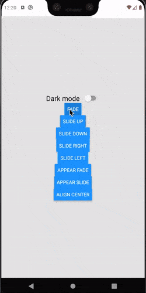
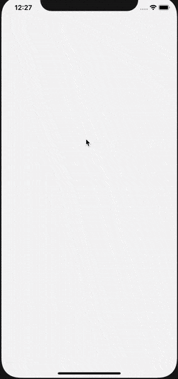
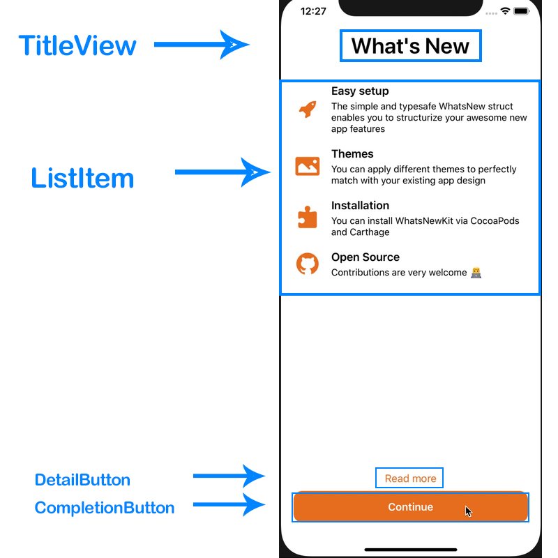
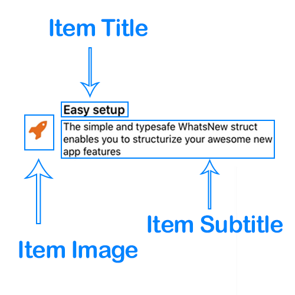

<h1 align="center">
  React Native New Feature
</h1>
<p align="center">
  ☀️Simple and lightweight What's New style component that shows your React Native app new features☀️
</p>

<div align="center">
  <a href="https://www.npmjs.com/package/react-native-new-feature" target="_blank">
    
  </a>

  <a href="https://www.npmjs.com/package/react-native-new-feature" target="_blank">
    
  </a>

  <a href="https://github.com/maitrungduc1410/react-native-new-feature/blob/master/LICENSE" target="_blank">
    
  </a>

  <a href="https://github.com/maitrungduc1410/react-native-new-feature" target="_blank">
    
  </a>
  </div>
<div align="center">
  
  
</div>
<h2 align="center">
  If you like this project, encourage me by giving a ⭐️. Happy hacking
</h2>

# Table of Contents
1. [Installation](#Installation)
2. [Basic usage](#basic-usage)
3. [List animations](#list-animations)
4. [Customization](#Customization)
    1. [TitleView](#TitleView)
    2. [ListItem](#ListItem)
    3. [Detail Button](#Detail-Button)
    4. [Completion Button](#Completion-Button)
    5. [Margin and padding](#margin-and-padding)
    6. [Animations](#Animations)
5. [Orientation change support](#Orientation-change-support)
6. [Demo](#Demo)

# Installation
With npm:
`$ npm install react-native-new-feature --save`

With yarn:
`$ yarn add react-native-new-feature`
# Basic usage
```js
import NewFeature from 'react-native-new-feature'

const App = (props) => {
  const data = {
    title: {
      text: 'What\'s New',
    },
    items: [
      {
        title: {
          text: 'Easy setup',
        },
        subtitle: {
          text: 'The simple and typesafe WhatsNew struct enables you to structurize your awesome new app features',
        },
        image: {
          component: <Image source={require('./assets/icons8-approval-100.png')} style={{ width: 45, height: 45, tintColor: 'red' }}/>,
        }
      },
    ],
    detailButton: {
      text: 'Read more',
    },
    completionButton: {
      text: 'Continue',
    }
  }

  return (
    <NewFeature
      visible={true}
      title={data.title}
      items={data.items}
      detailButton={{
        ...data.detailButton,
      }}
      completionButton={{
        ...data.completionButton,
      }}
    />
  )
}
```
# Customization
`React Native New Feature` can be fully customized as your need. Below is detail of sub components included and list of animations available:

<div align="center">
  
</div>

## TitleView
```ts
Properties:
- text: string (required)
- color: string
- size: number
- weight: '600' // same as fontWeight property. default is '600'
```

Usage:
```js
<NewFeature
  title={{
    text: 'Title',
    color: 'black',
    size: 35
  }}
  {...other props}
/>
```

## ListItem
This component uses `ScrollView` to render list of new features, each row is a `ItemView` component which made from 3 sub-components `ItemImage`, `ItemTitle` and `ItemSubtitle` as described in picture below:

<div align="center">
  
</div>

To customize these components,read the sections below.

### Item Image
```js
Properties:
- component: <React component> (required),
```
### Item Title and Item Subtitle
```ts
Properties:
- text: string (required)
- color: string // default is 'black' if don't specify
- size: number // default is 17 if don't specify
- weight: 'bold' // same as fontWeight property
```

## Detail Button
```ts
Properties:
- text: string (required)
- color: string
- size: number
- weight: 'bold' // same as fontWeight property
- handler: function
```

Usage:
```js
const myHandler = () => {
  console.log(1)
}

<NewFeature
  detailButton={{
    text: 'Read more',
    color: 'red',
    size: 17,
    handler: myHandler
  }}
  {...other props}
/>
```

## Completion Button
```ts
Properties:
- text: string (required),
- color: string,
- size: number
- background: string,
- radius: number,
- weight: 'bold' // same as fontWeight property
- handler: function
```

Usage:
```js
const myHandler = () => {
  console.log(1)
}

<NewFeature
  completionButton={{
    text: 'Read more',
    color: 'red',
    background: 'blue',
    radius: 14
    size: 17,
    handler: myHandler
  }}
  {...other props}
/>
```

## Margin and Padding
`margin` and `padding` props are provided in order to help you have more control on layout. These props are applied to these components:
- `TitleView`
- `ItemImage`
- `ItemTitle`
- `ItemSubtitle`
- `DetailButton`
- `CompletionButton`

Usage:
```js
<NewFeature
  title={{
    margin: {
      top: 1,
      right: 2,
      bottom: 3,
      left: 4
    },
    padding: {
      top: 5,
      right: 6,
      bottom: 7,
      left: 8
    }
  }}
  {...other props}
/>
```

## Animations
This package have 2 types of animations:
- Animation on root component appear
- Animation of the ListItem
### Root component animation
Root component makes use of `Modal` component which is built-in of React Native
Usage:
```js
<NewFeature
  appearAnimation={'fade'}
/>
```

`appearAnimation` is one of:
- `none` (default if not specified)
- `fade`
- `slide`
### ListItem animation
Usage:
```js
<NewFeature
  animation={'slide-down'}
/>
```

`animation` is one of:
- `none` (default if not specified)
- `fade`
- `slide-up`
- `slide-down`
- `slide-right`
- `slide-left`

# Orientation change support
By using purely React Native View flex layout, this component is auto-compatible when device orientation changed

# Demo
A complete working demo is located at [example folder](./example/Home.js)